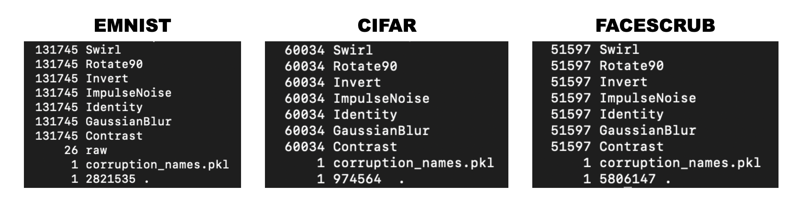
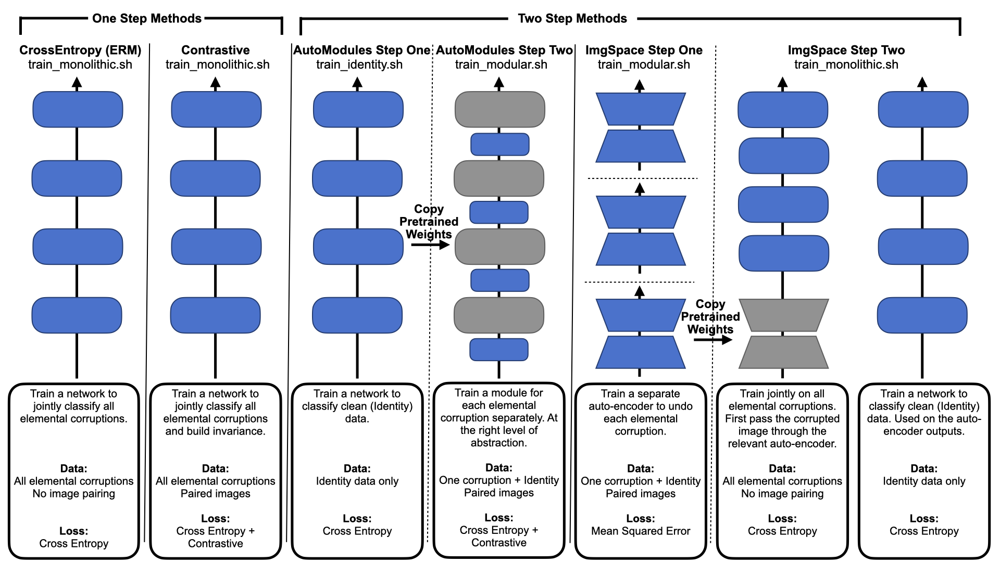

# Modularity Trumps Invariance for Compositonal Robustness
This repository contains the code for the paper [Modularity Trumps Invariance for Compositonal Robustness](https://arxiv.org/abs/2306.09005).

## Dependencies
The dependencies for this project can be found in ```docker/Dockerfile```. The Docker
image is also currently available on [DockerHub](https://hub.docker.com/repository/docker/ianxmason/pytorch/general).

The code should also be runnable in a conda environment with a fairly standard PyTorch set up using python3. 
This is untested, but the key packages should be: ```pytorch```, ```torchvision```, ```numpy```, ```matplotlib```, 
```pillow```, ```pandas```, ```seaborn```, ```scikit-image```, ```opencv-python``` and ```scipy```.

#### A Note on Slurm & Singularity
The code in this repo is written to be run on a cluster using [Slurm](https://slurm.schedmd.com/documentation.html) and
[Singularity](https://docs.sylabs.io/guides/3.5/user-guide/introduction.html). The Docker image is converted into a Singularity image.

The code is almost all executed via ```sbatch``` and the shell scripts in ```src/scripts```.
- If using Singularity and Slurm you should only need to add your slurm logging path, bind paths and path to the 
  Singularity image in these scripts.
- If working on a system without these tools it should be possible to run the code by taking the commands in these scripts
  (beginning ```singularity exec ...```) and running only the part of the command that starts with ```python ...```.
  - Commands that contain ```$SLURM_ARRAY_TASK_ID``` will need to be run with ```$SLURM_ARRAY_TASK_ID``` set to each 
    of the values in the range shown in ```#SBATCH --array```.

## Data Generation

All commands should be run from inside the ```src``` directory. The corrupting functions are defined in 
```data/data_transforms.py``` where new corruptions can be added and/or the severity of corruptions can be changed. 
The corruptions are designed to work as [torchvision transforms](https://pytorch.org/vision/stable/transforms.html)
so should be able to be applied to most standard vision datasets.

#### EMNIST
First download the base dataset to the directory where you want to generate the training data. 
In an interactive python session run:
```python
from data.emnist import _get_emnist_datasets
_get_emnist_datasets("<path to data root>")
```
This should create a directory ```EMNIST/raw``` in ```<path to data root>``` containing the base dataset.

To generate the corruptions for training.
Run the first python command in ```generate_data.sh``` after adding the ```--data-root``` flag to match your ```<path to data root>```.
```
sbatch scripts/generate_data.sh
```

#### CIFAR10
CIFAR10 follows a similar process as EMNIST. First download the base data
```python
from data.cifar import _get_cifar_datasets
_get_cifar_datasets("<path to data root>")
```
You should see the directory ```cifar-10-batches-py``` and file ```cifar-10-python.tar.gz``` in the data root directory.

Then run the second python command in ```generate_data.sh```. Again changing ```--data-root``` as needed.
```
sbatch scripts/generate_data.sh
```

#### FACESCRUB
FaceScrub cannot be directly downloaded, you can request access to the dataset [here](http://vintage.winklerbros.net/facescrub.html).
We used an internal version of the dataset which is a subset of the original where identities with less than 100 images
are discarded following [this paper](https://www.pnas.org/doi/epdf/10.1073/pnas.1800901115) (section _Simulation 2_). 
We end up with 388 identities (classes). These are in a flat directory structure in ```<path to data root>/FaceScrub/``` with the images named as ```<identity number>_<image number>.jpg```. 
Where ```<identity number>``` is between 100 and 487 (inclusive).

Given this directory structure you can run the third python command in ```generate_data.sh```. Again changing ```--data-root``` as needed.
```
sbatch scripts/generate_data.sh
```

#### Generating Corruption Names for Training
Running the following command will generate a file called ```corruption_names.pkl``` in the ```data_root/EMNIST``` directory.
You will need to change the absolute path to your data root in line 8 before running.
```
python data/sample_corruptions.py
```
This file is a random sample to get all the combinations and permuations of corruptions that will be used for testing our models.

CIFAR and FACESCRUB also need a corruption names file. The sampling script can be run again, but easiest is to copy the EMNIST file.
In your data root run:
```
cp EMNIST/corruption_names.pkl CIFAR/
cp EMNIST/corruption_names.pkl FACESCRUB/
```

#### Checking the Data Generation
After generation you should have in your data root directories called 

- ```EMNIST/```
- ```CIFAR/```
- ```FACESCRUB/```

Inside each of these directories you can run the following command to count the number of files
```du -a | cut -d/ -f2 | sort | uniq -c | sort -nr```

This should output something like this for each dataset (the numbers are important and should match)


## Training


To train the different methods we use the scripts ```scripts/train_monolithic.sh```, ```scripts/train_modules.sh``` and
```scripts/train_identity.sh```. The different methods we consider are shown in the above figure, where blue boxes are 
trainable parameters and gray boxes are frozen. The monolithic methods (Cross Entropy and Contrastive training) require
one command to run, whereas the modular methods (AutoModules and ImgSpace) require two commands.

To train networks using the cross entropy or contrastive loss run the relevant command in ```scripts/train_monolithic.sh```.
For example, to train a network on EMNIST using the cross entropy loss run the first line beginning ```singularity exec ...```
which has ```--experiment "CrossEntropy"```. 
Commands are also given for other datasets and for contrastive training. You will need to add the ```--data-root``` flag
to point to your data directory and set ```--ckpt-path```, ```--logging-path``` and ```--vis-path``` to point to where
you want to save the checkpoints, logs and data visualisations.

To train the modular approach first run the relevant command for the dataset you are using from 
```scripts/train_identity.sh```. After this network has finished training run the command for the dataset you are using from ```scripts/train_modules.sh```,
this is the command with ```--experiment "AutoModules"```. For both commands again set ```--data-root```,
```--ckpt-path```, ```--logging-path``` and ```--vis-path```.

To train auto-encoders to undo each corruption, first run the relevant command for the dataset you are using from 
```scripts/train_modules.sh```, this is the command with ```--experiment "ImgSpace"```. Once the auto-encoders are 
trained, two different classifiers can be trained using the command in ```scripts/train_monolithic.sh``` with
```--experiment "ImgSpace"```. Again set ```--data-root```, ```--ckpt-path```, ```--logging-path``` and ```--vis-path```.


## Testing & Analysis

If the code runs correctly model checkpoints should be saved in the directory specified by ```--ckpt-path```. The 
different methods can then be evaluated by running the ```scripts/test.sh``` script. 
Here the arguments ```--dataset```, ```--total-n-classes``` and ```--experiment```
should be set according to the experiment that you wish to evaluate. The options for ```--dataset``` are ```EMNIST```,
```CIFAR```, and ```FACESCRUB``` which have ```--total-n-classes``` of ```47```, ```10``` and ```388``` respectively.
The options for ```--experiment``` are ```CrossEntropy```, ```Contrastive```, ```AutoModules``` and ```ImgSpace```.

Once again you will need to point to the directories where the data is stored with ```--data-root``` and where the 
checkpoints are stored with ```--ckpt-path```. The arguments ```--save-path```, ```--activations-path``` and ```--vis-path```
should be set to the locations where you want to save the results, neural activations and visualisations respectively.

Once the testing completes, box plots comparing experiments can be generated by running ```python comparison_plots.py```
from inside the ```analysis``` directory. Correlations between invariance scores and compositional robustness can be 
generated by running ```python invariance_plots.py```. Flags ```--data-root```, ```--results-path```, ```save-path```
and ```--activations-path``` need to be set to the correct directories.

The analysis directory also contains code for saving and processing neural activity for use with the interpretability
tool [Deephys](https://deephys.org).

## Hyperparameter Searching
For completeness, we provide the results of our hyper-parameter search [here](https://docs.google.com/spreadsheets/d/14tKjwqdU2hVBjWhOiVKYzchEYI6AboL41eBMWeUtJxA/edit?usp=sharing)
The training process is as described above but models are evaluated using the code in ```validate.py```. For two step
methods, we find the best hyper-parameters for the first step, then fix these to find the best hyper-parameters
for the second step.

## Citation
If you use this code in your research please cite the following paper:
```
@article{mason2023modularity,
  title={Modularity Trumps Invariance for Compositional Robustness},
  author={Mason, Ian and Sarkar, Anirban and Sasaki, Tomotake and Boix, Xavier},
  journal={arXiv preprint arXiv:2306.09005},
  year={2023}
}
```


